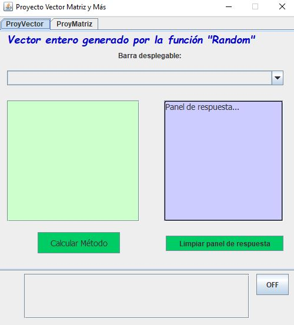
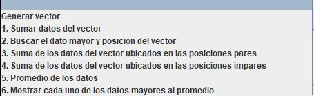
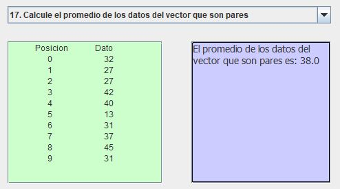
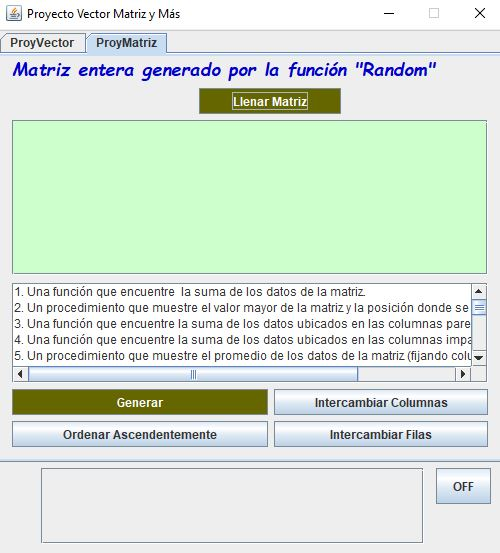
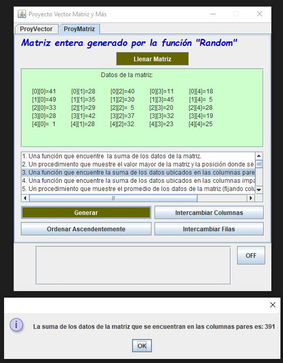

# ProyVMM_v4

## Proyecto de arreglos de datos (Vectores y Matrices)

Se trata de un proyecto desarrollado en el lenguaje de programación Java que contiene diferentes operaciones con vectores y matrices. La aplicación se ve como lo muestran los siguientes pantallazos:

## Vectores

### Pantalla principal

### Funciones que se pueden ejecutar en el vector generado

## Matrices

### Pantalla pricipal matriz

### Funciones que se pueden ejecutar en la matriz generada

